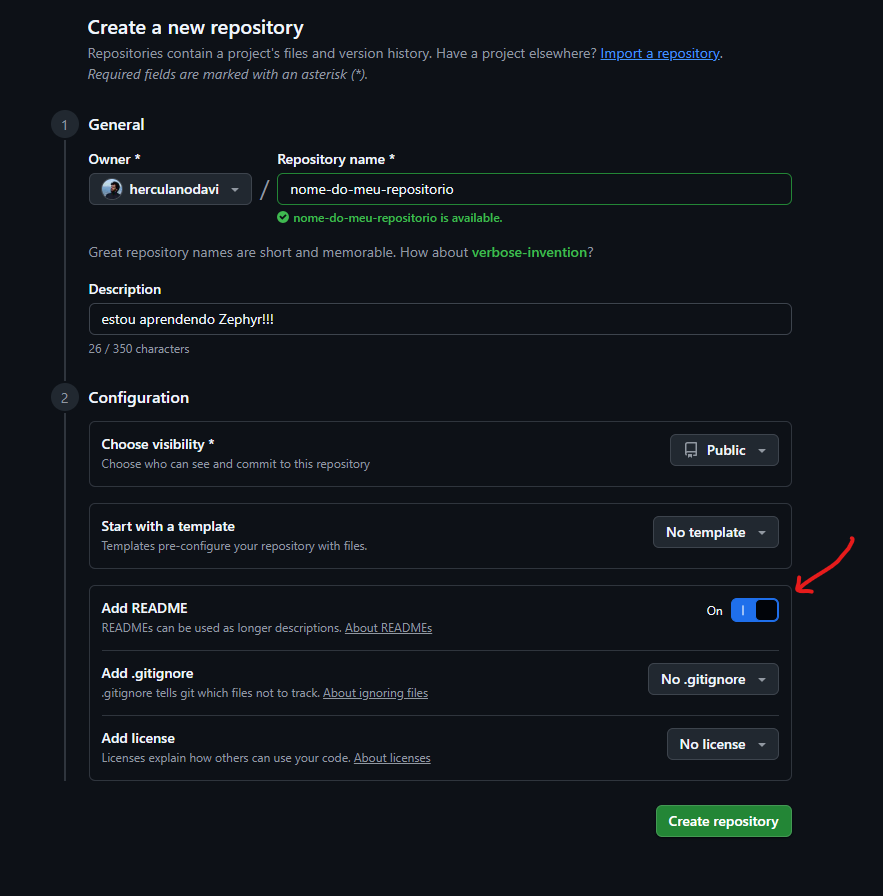

# Criando seu proprio repositório

Esse é um guia para você criar seu primeiro repositório Zephyr. Com ele, você vai poder definir dependências, descrições
de placas, drivers, e também criar várias aplicações que compartilham todas essas definições.

> [!NOTE]
> Existem muitas maneiras de organizar um repositório de aplicação Zephyr. Se você quiser se aprofundar e
escolher uma maneira, leia [a documentação](https://docs.zephyrproject.org/latest/develop/west/workspaces.html#topologies-supported)
para ter uma base. Nós vamos utilizar a topologia T2 star.


# Esqueleto de uma aplicação 

Primeiro, [crie um repositório no Github](https://github.com/new) com apenas um README.md. 




Então, crie uma pasta no seu computador. Essa vai ser nosso espaço de trabalho, então vou chamar de `workspace`. Dentro desse workspace,
crie um ambiente virtual Python, e o ative:

```
cd <caminho-para-workspace>/workspace/
python3 -m virtualenv .venv
source .venv/bin/activate
```

Agora, clone seu repositório dentro de `workspace`:

```
git clone <url-do-meu-repositório>
```

Com isso, temos:

```
workspace/
├── .venv/
└── meu-repositorio/
    ├── .git/
    └── README.md
```

## Iniciando um west workspace

A nossa pasta `workspace` vai conter quase tudo que precisamos para desenvolver nossas aplicações:
1. ambiente virtual Python
2. nosso código-fonte do repositório
3. todas as dependências que precisarmos

A única coisa que fica de fora é o SDK, que instalamos à parte.

Da nossa lista acima, precisamos agora de uma forma de declarar nossas dependências para que elas sejam coletadas automaticamente.
Para isso, temos o `west.yml`, ou West Manifest. Vamos ver a estrutura de um:

```yaml
manifest:
  # indica o caminho para o repositório da aplicação
  self:
    path: <meu-repositorio>

  # indica a URL dos remotes (servidores git) que vamos usar
  remotes:
    - name: zephyrproject-rtos
      url-base: https://github.com/zephyrproject-rtos/

  # indica quais dependências vamos usar
  projects:
    # dependência em zephyr v4.2.0, que está em <zephyrproject-rtos>/zephyr
    - name: zephyr
      path: zephyr
      remote: zephyrproject-rtos
      revision: v4.2.0
      # zephyr define comandos adicionais nesse caminho
      west-commands: scripts/west-commands.yml
      import:
        # colete as dependências na pasta deps/
        path-prefix: deps
        # das dependências do zephyr, só colete as da lista
        name-allowlist:
          - cmsis_6      
          - hal_stm32 
```

Esse arquivo fica na raiz do seu repositório. Portanto, agora temos:

```
workspace/
├── .venv/
└── meu-repositorio/
    ├── .git/
    ├── README.md
    └── west.yml
```

Agora, vamos primeiro inicializar o sistema de dependências e então executar uma resolução. Estando na pasta `workspace`, digite:

```
west init -l <meu-repositorio>
```

Isso vai criar uma pasta `workspace/.west` com informações de onde está seu West Manifest:

```
$ cat .west/config
[manifest]
path = meu-repositorio
file = west.yml
```

Vamos agora executar uma resolução, ou seja, `west` vai ler o manifest, comparar com o que está baixado e resolver diferenças. Como não temos nada ainda, ele vai apenas coletar as dependências:

```
west update
````

Agora, nosso workspace está pronto para começarmos desenvolvimento, como mostra abaixo. Vamos criar nossa primeira aplicação.

```
workspace/
├── .venv/
├── meu-repositorio/
│   ├── .git/
│   ├── README.md
│   └── west.yml
└── deps/
    └── zephyr/
```

## Escrevendo uma aplicação

Agora, vamos entrar em `meu-repositório` e criar duas pastas de aplicação, `app/` e `samples/hello_world`:
```
meu-repositorio
├── app
├── samples
│   └── hello_world
└── west.yml
```

A pasta samples terá aplicações de demonstração, ou de teste rápido. Você pode acumular várias `samples` para apoiar o desenvolvimento
de `app`. O conteúdo dessas pastas é o mesmo, então vou demonstrar apenas para `app/`:

```
app/
├── CMakeLists.txt
├── prj.conf
└── src
    └── main.c
```

Em `CMakeLists.txt`, escreva um arquivo mínimo de aplicação:

```Cmake
# mínima versão exigida de CMake
cmake_minimum_required(VERSION 3.13.1)

# encontre o pacote Zephyr para usar na aplicação
find_package(Zephyr REQUIRED HINTS $ENV{ZEPHYR_BASE})

# declare o projeto app, escrito em C
project(app LANGUAGES C)

# app tem como código-fonte src/main.c
target_sources(app PRIVATE src/main.c)
```

Em `prj.conf`, deixe o arquivo em branco. Esse arquivo conterá todas as configurações dos módulos que vão compor a aplicação. 
Nesse arquivo, você pode configurar flags de otimização de compilação, nível de log, ativação de componentes e muito mais.

Em `src/main.c` está nossa aplicação, como qualquer projeto em C: 

```C
int main(void)
{
    return 0;
}
``` 

Agora, volte para `workspace` e faça:

```
west build -p -b <sua-placa> meu-repositorio/app
```

Parabéns, você acabou de compilar um binário de firmware! Agora você já pode editar `main.c` para fazer seu primeiro programa.

# Projeto para casa

Agora que você já tem um repositório, vamos adicionar algumas aplicações de amostra. Adicione as amostras `hello_world` e `blinky` no projeto. Use as amostras que já existem no repositório Zephyr para conseguir programar.

- [hello_world](https://github.com/zephyrproject-rtos/zephyr/tree/main/samples/hello_world)
- [blinky](https://github.com/zephyrproject-rtos/zephyr/tree/main/samples/basic/blinky)

Para quaisquer dúvidas, podem entrar em contato comigo. Boa sorte!