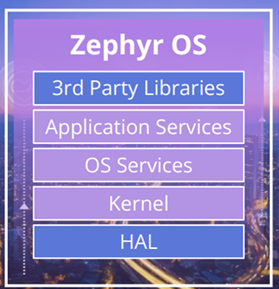

# Curso de Zephyr OS para ITAndroids
# Aula 01: Fundamentos de Zephyr OS + GPIO
## Davi Herculano

---

# Introdução ao Zephyr

- O que é um OS (Sistema Operational)?
- O que é um RTOS (OS de Tempo Real)?
- Pra que eu preciso de um (RT)OS?
- Zephyr é um RTOS?

--- 

# Introdução ao Zephyr
## O que é um OS?

- Software fundamental que gere e controla os recursos de um sistema
- Fornece serviços para outros programas usarem
    - Você consegue pensar em um serviço de OS? 
- Exemplos: Windows 11, macOS, Android

---

# Introdução ao Zephyr
## O que é um RTOS?

- OS com prazos estritos de tempo (timeout)
- Feito para atividades que não podem "atrasar":
    - Controle de motores
    - Marcapasso
    - Processamento de áudio
- Exemplos: FreeRTOS, ThreadX, Zephyr

---

# Introdução ao Zephyr
## Pra que eu preciso de um (RT)OS?

- É possível rodar um programa sem OS: Bare Metal
- Organização de tarefas por concorrência
- Desacoplamento de componentes e prazos de cada componente
    - Exemplo: uma malha de controle a 1Hz e outra a 100Hz

---

# Introdução ao Zephyr
## Zephyr é um RTOS?

- "Zephyr tem um RTOS"
- Zephyr é um ecossistema de desenvolvimento:
    - RTOS
    - Drivers
    - Ambiente de desenvolvimento

---

# Introdução ao Zephyr
## Por que eu gostaria de aprender Zephyr?

- Independente de fabricante: funciona com STM32, NXP, nRF, ESP32 e outros.
- Padrão de mercado para dispositivos IoT
- Apoiado pela Fundação Linux
- Usado em:
    - Samsung Galaxy Ring
    - Google Chromebook
    - Framework Laptop
    - ADAM Audio :)

---

# Ambiente de Desenvolvimento
- Configuração do ambiente
- Primeiro projeto (Hello World)

--- 

# Ambiente de Desenvolvimento
## Configuração do ambiente

- Instalar dependências: [Zephyr - Getting started guide](https://zephyr-docs.listenai.com/getting_started/index.html)
- Setup para VSCode

--- 

# Ambiente de Desenvolvimento
## Primeiro projeto (Hello World / Blinky)

- Ative seu `virtualenv`
- `cd <caminho-para-zephyr>`
- Compile sua aplicação:
    - `west build -p -b <sua_placa> samples/basic/blinky`
    - `west build -p -b <sua_place> samples/hello_world`
- `west flash`

--- 

# Ambiente de Desenvolvimento
## Primeiro projeto

- Aplicações também podem ser simuladas
- `native_sim`:
    - Compila uma aplicação nativa que roda no OS
    - Não há garantias de timing
- `qemu_cortex_m3`:
    - Compila uma aplicação que roda num simulador de ARM Cortex M3
    - Há garantias de timing na linha do tempo do simulador
- Executar aplicação: `west build -t run`

--- 

# Dúvidas?

---

# Projeto para casa

- Leia `aula_01/criar-seu-repositorio.md` e crie a estrutura do seu projeto do curso.
- Crie a sua primeira aplicação, `hello_world`, copiando do exemplo.